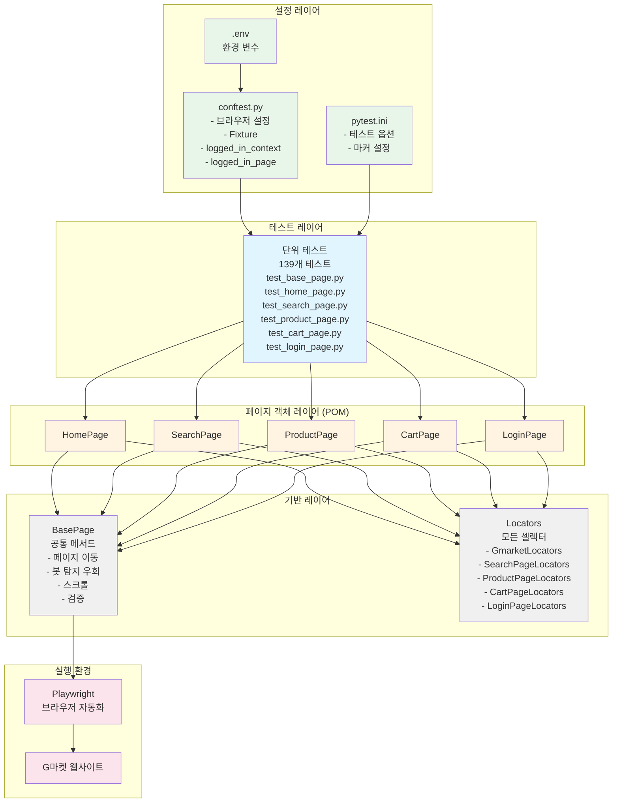
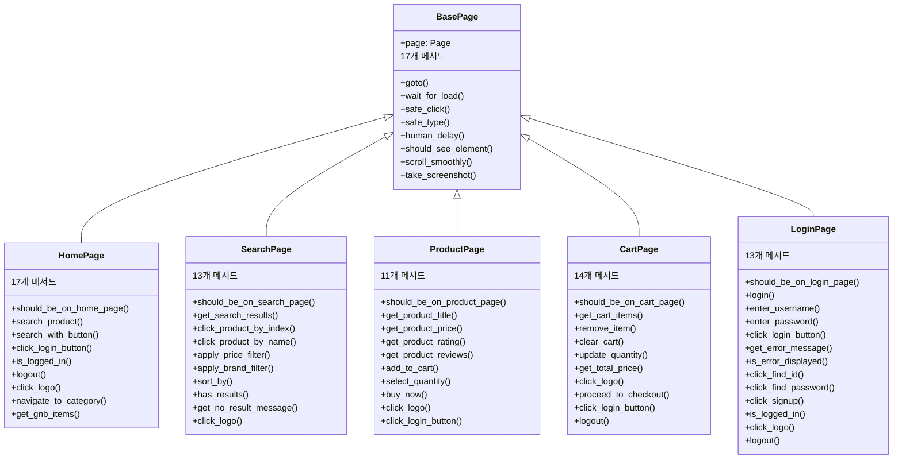
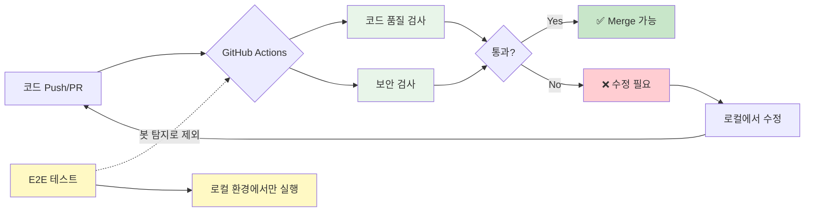

# 🛒 G마켓 자동화 테스트 프로젝트

[](https://www.python.org/)
[](https://playwright.dev/)
[](https://github.com/psf/black)
[](https://github.com/Yangsun94/Gmarket_Project.git)
[](https://github.com/Yangsun94/Gmarket_Project/actions)

Playwright를 활용한 G마켓 쇼핑몰 E2E 자동화 테스트 프레임워크입니다.

## 📋 목차

- [프로젝트 소개](#-프로젝트-소개)
- [주요 기능](#-주요-기능)
- [기술 스택](#-기술-스택)
- [프로젝트 구조](#-프로젝트-구조)
- [설치 방법](#-설치-방법)
- [사용 방법](#-사용-방법)
- [테스트 실행](#-테스트-실행)
- [CI/CD](#-cicd)
- [코드 품질](#-코드-품질)
- [학습 내용](#-학습-내용)
- [트러블슈팅](#-트러블슈팅)

## 🎯 프로젝트 소개

이 프로젝트는 G마켓 쇼핑몰의 주요 기능을 자동으로 테스트하는 E2E(End-to-End) 테스트 프레임워크입니다. Page Object Model 패턴을 적용하여 유지보수성과 재사용성을 높였으며, pytest를 기반으로 체계적인 테스트 환경을 구축했습니다.

### 🎓 학습 목표

- **Playwright**를 활용한 웹 자동화 테스트 구현
- **Page Object Model** 디자인 패턴 적용
- **단위 테스트** 작성 및 커버리지 관리
- **GitHub Actions**를 통한 CI/CD 파이프라인 구축
- **코드 품질 관리** 자동화 (Black, isort, Flake8, Pylint)
- **실전 문제 해결**: 봇 탐지 시스템 우회 및 Rate Limiting 처리

## ✨ 주요 기능

### 테스트 범위

- ✅ **홈페이지**: 방문, 로고 클릭, 검색 기능
- ✅ **검색 페이지**: 상품 검색, 필터링, 정렬, 상품 클릭
- ✅ **상품 상세 페이지**: 상품 정보 조회, 장바구니 담기
- ✅ **장바구니**: 상품 확인, 수량 변경, 삭제
- ✅ **로그인/로그아웃**: 인증 플로우

### 특징

- 🤖 **봇 탐지 우회**: 자연스러운 사용자 행동 시뮬레이션 (랜덤 딜레이, 마우스 움직임)
- 📸 **자동 스크린샷**: 테스트 실패 시 자동 캡처
- 📊 **HTML 리포트**: 테스트 결과 시각화
- 🔄 **재사용 가능한 구조**: Page Object Model 패턴
- 🧪 **단위 테스트**: 139개 테스트 (139개 Pass, 성공률 100%)
- ⚡ **병렬 실행**: pytest-xdist를 통한 빠른 테스트
- 🔐 **세션 기반 로그인**: Rate Limiting 문제 해결
- 🔄 **CI/CD 파이프라인**: 자동화된 코드 품질 검사

# 🏗️ 프로젝트 아키텍처

## 전체 구조



## Page Object Model 패턴



## 🛠 기술 스택

### Core
- **Python 3.10+**: 메인 언어
- **Playwright 1.48.0**: 웹 자동화 라이브러리
- **pytest 8.3.3**: 테스트 프레임워크

### Testing
- **pytest-html**: HTML 테스트 리포트 생성
- **pytest-xdist**: 병렬 테스트 실행
- **pytest-playwright**: Playwright pytest 플러그인
- **pytest-cov**: 코드 커버리지 측정

### Code Quality
- **Black 23.12.1**: 코드 포맷터 (line-length=120)
- **isort**: Import 정렬
- **Flake8**: 린터 (PEP 8 검사)
- **Pylint**: 정적 코드 분석
- **pre-commit**: Git hook 자동화

### CI/CD
- **GitHub Actions**: 자동화 워크플로우
- **Safety**: 보안 취약점 검사

## 📁 프로젝트 구조

```
gmarket-automation/
├── .github/
│   └── workflows/
│       └── quality-check.yml      # CI/CD 파이프라인
├── framework/
│   ├── base/
│   │   └── base_page.py           # 베이스 클래스 (17개 메서드)
│   ├── config/
│   │   └── locators.py            # 모든 페이지 Locator 정의 (5개 클래스)
│   └── pages/
│       ├── home_page.py           # 홈페이지 (10개 메서드)
│       ├── search_page.py         # 검색 페이지 (13개 메서드)
│       ├── product_page.py        # 상품 상세 페이지 (11개 메서드)
│       ├── cart_page.py           # 장바구니 페이지 (14개 메서드)
│       └── login_page.py          # 로그인 페이지 (13개 메서드)
├── tests/
│   └── unit/                      # 단위 테스트 (총 139개)
│       ├── test_base_page.py      # BasePage 단위 테스트 (17개)
│       ├── test_home_page.py      # HomePage 단위 테스트 (24개)
│       ├── test_search_page.py    # SearchPage 단위 테스트 (41개)
│       ├── test_product_page.py   # ProductPage 단위 테스트 (16개)
│       ├── test_cart_page.py      # CartPage 단위 테스트 (30개)
│       └── test_login_page.py     # LoginPage 단위 테스트 (11개)
├── reports/                       # 테스트 리포트 저장 폴더
├── screenshots/                   # 스크린샷 저장 폴더
├── .env                           # 환경 변수 (git 제외)
├── .env.example                   # 환경 변수 예시
├── .gitignore                     # Git 제외 파일
├── .pre-commit-config.yaml        # pre-commit 설정
├── conftest.py                    # pytest 설정 및 fixture
├── pytest.ini                     # pytest 옵션 설정
├── requirements.txt               # 프로젝트 의존성
└── README.md                      # 프로젝트 문서
```

## 🚀 설치 방법

### 1. 저장소 클론

```bash
git clone https://github.com/Yangsun94/Gmarket_Project.git
cd gmarket-automation
```

### 2. 가상환경 생성 및 활성화

```bash
# Windows
python -m venv venv
venv\Scripts\activate

# macOS/Linux
python3 -m venv venv
source venv/bin/activate
```

### 3. 의존성 설치

```bash
pip install -r requirements.txt
playwright install chromium
```

### 4. 환경 변수 설정

`.env.example`을 복사하여 `.env` 파일을 생성하고 계정 정보를 입력합니다:

```bash
cp .env.example .env
```

`.env` 파일 예시:
```env
TEST_ID=your_gmarket_id
TEST_PASSWORD=your_gmarket_password
```

### 5. pre-commit 설치

```bash
pre-commit install
```

## 🧪 테스트 실행

### 전체 단위 테스트 실행

```bash
pytest tests/unit/ -v
```

**실행 결과:**
- ✅ **139개 테스트** (139개 Pass)
- ⏱️ **실행 시간**: 00:34:11

### 특정 테스트 파일만 실행

```bash
# BasePage 테스트 (17개)
pytest tests/unit/test_base_page.py -v

# HomePage 테스트 (24개)
pytest tests/unit/test_home_page.py -v

# SearchPage 테스트 (41개)
pytest tests/unit/test_search_page.py -v

# ProductPage 테스트 (16개)
pytest tests/unit/test_product_page.py -v

# 장바구니 테스트 (30개)
pytest tests/unit/test_cart_page.py -v

# 로그인 테스트 (11개)
pytest tests/unit/test_login_page.py -v
```

### 특정 마커로 실행

```bash
# smoke 테스트만 (빠른 핵심 검증)
pytest tests/unit/ -m smoke -v

# 로그인 테스트만
pytest tests/unit/ -m login -v

# 장바구니 테스트만
pytest tests/unit/ -m cart -v

# 느린 테스트 제외
pytest tests/unit/ -m "not slow" -v

# login 제외하고 병렬 실행
pytest tests/unit/ -m "not login" -n auto
```

### pytest 마커 설명

| 마커 | 설명 | 사용 예시 |
|------|------|----------|
| `smoke` | 핵심 기능 빠른 검증 | `pytest -m smoke` |
| `regression` | 회귀 테스트 | `pytest -m regression` |
| `login` | 로그인 필요 (순차 실행) | `pytest -m login` |
| `cart` | 장바구니 관련 | `pytest -m cart` |
| `slow` | 느린 테스트 | `pytest -m "not slow"` |

### 병렬 테스트 실행

```bash
# 자동으로 CPU 코어 수만큼 병렬 실행
pytest tests/unit/ -n auto

# 특정 워커 수 지정 (4개)
pytest tests/unit/ -n 4

# login 테스트 제외하고 병렬 실행 (권장)
pytest tests/unit/ -m "not login" -n auto
```

> ⚠️ **주의**: `@login` 마커가 있는 테스트는 세션 기반 로그인을 사용하므로 병렬 실행 시 제외해야 합니다.

### HTML 리포트 생성

```bash
pytest tests/unit/ --html=reports/report.html --self-contained-html
```

### 테스트 커버리지 측정

```bash
# 커버리지 측정 + HTML 리포트
pytest tests/unit/ --cov=framework --cov-report=html --cov-report=term

# 리포트 확인
open htmlcov/index.html  # macOS
start htmlcov/index.html  # Windows
xdg-open htmlcov/index.html  # Linux
```

## 🎬 테스트 실행 결과

### 📊 테스트 리포트

**전체 테스트 결과 요약:**
- ✅ **136개 테스트 통과** / 139개
- 📂 **6개 테스트 파일**
- ⏱️ **실행 시간**: 00:34:11
- ⚡ **병렬 실행 지원** (pytest-xdist)
- 📸 **실패 시 자동 스크린샷 저장**
- 📝 **상세 로그 및 에러 추적**

**테스트 파일별 개수:**

| 파일 | 테스트 개수 | 설명 |
|------|------------|------|
| `test_base_page.py` | 17 | BasePage 공통 기능 테스트 |
| `test_home_page.py` | 24 | 홈페이지 기능 테스트 |
| `test_search_page.py` | 41 | 검색 및 필터링 테스트 |
| `test_product_page.py` | 16 | 상품 상세 페이지 테스트 |
| `test_cart_page.py` | 30 | 장바구니 기능 테스트 |
| `test_login_page.py` | 11 | 로그인/로그아웃 테스트 |
| **합계** | **139** | - |

---

### 📈 코드 커버리지

**커버리지 측정 결과: 55%**

| 모듈 | Statements | Missing | Coverage |
|------|-----------|---------|----------|
| `framework/base/__init__.py` | 0 | 0 | **100%** |
| `framework/base/base_page.py` | 102 | 41 | **60%** |
| `framework/config/__init__.py` | 0 | 0 | **100%** |
| `framework/config/locators.py` | 68 | 0 | **100%** |
| `framework/pages/__init__.py` | 0 | 0 | **100%** |
| `framework/pages/cart_page.py` | 168 | 78 | **54%** |
| `framework/pages/home_page.py` | 171 | 72 | **58%** |
| `framework/pages/login_page.py` | 45 | 16 | **64%** |
| `framework/pages/product_page.py` | 135 | 81 | **40%** |
| `framework/pages/search_page.py` | 192 | 107 | **44%** |
| **TOTAL** | **881** | **395** | **55%** |

> 📝 **참고**: pytest의 커버리지 측정은 실제 브라우저 동작 중 일부 실행 경로를 인식하지 못하는 경우가 있어, 실제 테스트 커버리지보다 낮게 측정될 수 있습니다.

---

### 💡 리포트 직접 확인

테스트 실행 후 생성되는 리포트를 직접 확인할 수 있습니다:

```bash
# HTML 리포트 열기
start reports/report.html         # 테스트 결과 (Windows)
start htmlcov/index.html          # 커버리지 상세 (Windows)

open reports/report.html          # macOS
xdg-open reports/report.html      # Linux
```

---

## 🔄 CI/CD

### GitHub Actions 워크플로우

이 프로젝트는 GitHub Actions를 통해 자동화된 코드 품질 검사를 수행합니다.

> ⚠️ **중요**: G마켓의 강력한 봇 탐지 시스템으로 인해 CI/CD 환경에서는 E2E 테스트 실행이 불가능합니다. 따라서 **코드 품질 검사**만 자동화하고, 실제 E2E 테스트는 로컬 환경에서 수동 실행합니다.

### 🚀 자동 실행 조건

워크플로우는 다음 조건에서 자동으로 실행됩니다:

| 트리거 | 조건 | 설명 |
|--------|------|------|
| **Push** | `main`, `develop` 브랜치 | 코드 푸시 시 자동 검사 |
| **Pull Request** | `main`, `develop` 브랜치 | PR 생성 시 자동 검사 |
| **Manual** | GitHub Actions 탭 | 수동 실행 가능 (workflow_dispatch) |

### 📋 검사 항목

#### 1️⃣ **코드 품질 검사** (Code Quality Check)

| 도구 | 검사 항목 | 목표 |
|------|----------|------|
| **Black** | 코드 포맷팅 일관성 | line-length=120 준수 |
| **isort** | Import 문 정렬 | profile=black 설정 |
| **Flake8** | PEP 8 스타일 가이드 | 코드 스타일 준수 |
| **Pylint** | 코드 품질 분석 | 7.0/10.0 이상 유지 |

```yaml
# 코드 포맷 검사
black --check framework/ tests/ --line-length=120 --diff

# Import 정렬 검사
isort --check-only framework/ tests/ --profile black --diff

# 스타일 검사
flake8 framework/ tests/ --max-line-length=120

# 품질 분석
pylint framework/ --fail-under=7.0 --max-line-length=120
```

#### 2️⃣ **보안 검사** (Security Check)

| 도구 | 검사 항목 | 목표 |
|------|----------|------|
| **Safety** | 의존성 보안 취약점 | 알려진 취약점 탐지 |

```yaml
# 보안 취약점 검사
safety check --json
```

### 🔧 로컬에서 코드 수정

CI/CD 검사 실패 시 로컬에서 자동 수정 가능:

```bash
# 1. 코드 포맷팅 자동 수정
black framework/ tests/ --line-length=120

# 2. Import 정렬 자동 수정
isort framework/ tests/ --profile black

# 3. 스타일 검사 (수동 수정 필요)
flake8 framework/ tests/ --max-line-length=120

# 4. 코드 품질 확인 (수동 수정 필요)
pylint framework/ --fail-under=7.0
```

### 🎯 E2E 테스트 실행 (로컬 환경)

봇 탐지 시스템으로 인해 E2E 테스트는 **로컬 환경에서만** 실행 가능합니다:

```bash
# 전체 단위 테스트 (실행 시간: ~34분)
pytest tests/unit/ -v

# smoke 테스트 (빠른 핵심 검증)
pytest tests/unit/ -m smoke -v

# 병렬 실행 (login 제외, 권장)
pytest tests/unit/ -m "not login" -n auto

# HTML 리포트 생성
pytest tests/unit/ --html=reports/report.html --self-contained-html

# 커버리지 측정
pytest tests/unit/ --cov=framework --cov-report=html
```

### 📊 워크플로우 결과 확인

1. **GitHub 저장소** → **Actions** 탭 이동
2. 최근 워크플로우 실행 내역 확인
3. 각 Job의 상세 로그 확인 가능
4. 실패 시 어떤 검사에서 실패했는지 확인

### 💡 CI/CD 전략 요약



**핵심 전략:**
- ✅ **자동화 가능**: 코드 품질, 보안 검사 → CI/CD에서 자동 실행
- ⚠️ **자동화 불가**: E2E 테스트 → 로컬에서 수동 실행
- 🎯 **목표**: 코드 품질은 자동 보장, 기능 테스트는 수동 검증

---

## ✅ 코드 품질

### 로컬에서 코드 품질 검사

```bash
# 1. Black: 코드 포맷팅
black framework/ tests/ --line-length=120

# 2. isort: Import 정렬
isort framework/ tests/ --profile black

# 3. Flake8: 스타일 검사
flake8 framework/ tests/ --max-line-length=120 --extend-ignore=E203,W503

# 4. Pylint: 정적 분석
pylint framework/ --fail-under=7.0

# 5. Safety: 보안 검사
safety check
```

### pre-commit 사용

Git commit 시 자동으로 코드 품질 검사가 실행됩니다:

```bash
git add .
git commit -m "feat: 새 기능 추가"
# → Black, isort, Flake8가 자동 실행됨
```

전체 파일 검사:

```bash
pre-commit run --all-files
```

## 🔧 주요 Fixtures (conftest.py)

### 세션 스코프 로그인
```python
@pytest.fixture(scope="session")
def logged_in_context(playwright):
    """
    세션 전체에서 재사용되는 로그인 컨텍스트
    - Rate Limiting 문제 해결
    - 로그인 상태 유지
    - 한 번만 로그인 수행
    """
```

### 로그인된 페이지
```python
@pytest.fixture
def logged_in_page(logged_in_context):
    """
    로그인된 상태의 페이지 제공
    - @login 마커 테스트에서 사용
    - 각 테스트마다 새 페이지 생성
    """
```

### 기본 페이지
```python
@pytest.fixture
def page(context):
    """
    기본 Playwright 페이지
    - 대부분의 테스트에서 사용
    - 로그인이 필요없는 테스트용
    """
```

### 자동 스크린샷
```python
@pytest.hookimpl(tryfirst=True, hookwrapper=True)
def pytest_runtest_makereport(item, call):
    """
    테스트 실패 시 자동으로 스크린샷 저장
    - screenshots/ 폴더에 저장
    - 타임스탬프 포함 파일명
    """
```

## 🐛 트러블슈팅

### 1. 봇 탐지 시스템 문제

**문제**: G마켓의 강력한 봇 탐지 시스템으로 인해 자동화 테스트가 차단되는 현상

**해결 시도**:
- ✅ Playwright stealth 기법 적용
- ✅ 자연스러운 사용자 행동 시뮬레이션 (랜덤 딜레이, 마우스 움직임)
- ✅ 브라우저 속성 스푸핑
- ✅ User-Agent 변경

**현재 상태**:
- ✅ 로컬 환경에서는 대부분의 테스트 실행 가능
- ❌ CI/CD 환경에서는 봇 탐지로 인해 E2E 테스트 불가
- ✅ 코드 품질 검사로 CI/CD 대체


### 2. Rate Limiting 문제

**문제**: 반복적인 로그인 시도로 인한 계정 일시 차단

**해결책**:
```python
@pytest.fixture(scope="session")
def logged_in_context(playwright):
    # 세션 전체에서 한 번만 로그인 수행
    # 모든 @login 테스트가 동일한 로그인 상태 공유
```

**효과**:
- 로그인 횟수 대폭 감소
- Rate Limiting 회피
- 테스트 실행 시간 단축

### 3. 병렬 실행 시 로그인 충돌

**문제**: pytest-xdist로 병렬 실행 시 로그인 세션 충돌

**해결책**:
```bash
# login 마커 테스트는 병렬 실행에서 제외
pytest tests/unit/ -m "not login" -n auto
```

## 📚 학습 내용

이 프로젝트를 통해 다음을 학습했습니다:

### 1. 웹 자동화 테스트
- ✅ Playwright를 활용한 E2E 테스트 자동화
- ✅ Page Object Model 디자인 패턴 적용
- ✅ 봇 탐지 우회 기법 (자연스러운 딜레이, 랜덤 타이핑, 마우스 움직임)
- ✅ 브라우저 속성 스푸핑

### 2. 테스트 설계
- ✅ 139개 단위 테스트 작성 (55% 커버리지 달성)
- ✅ pytest fixture를 활용한 테스트 격리
- ✅ 테스트 마커를 통한 선택적 실행 (smoke, login, cart, slow)
- ✅ 파라미터화 테스트로 다양한 시나리오 검증
- ✅ Rate Limiting 문제 해결 (세션 스코프 fixture)

### 3. CI/CD 파이프라인
- ✅ GitHub Actions 워크플로우 구축
- ✅ 코드 품질 자동화 검증
- ✅ 봇 탐지 환경 제약 대응
- ✅ 실무적 CI/CD 전략 수립

### 4. 코드 품질 관리
- ✅ Black, isort를 통한 일관된 코드 스타일 유지
- ✅ Flake8, Pylint를 통한 코드 품질 검증
- ✅ pre-commit hooks를 통한 자동화
- ✅ Safety를 통한 보안 취약점 검사

### 5. 실전 문제 해결
- ✅ 봇 탐지 시스템 우회 전략 수립 및 실험
- ✅ Rate Limiting 문제 분석 및 해결
- ✅ 병렬 실행 환경에서의 세션 관리
- ✅ 실제 운영 환경의 제약 조건 대응

## 📊 프로젝트 통계

### 코드 구성
- **총 페이지 클래스**: 6개 (BasePage + 5개 페이지)
- **총 메서드**: 71개
  - BasePage: 17개
  - HomePage: 17개
  - SearchPage: 13개
  - ProductPage: 9개
  - CartPage: 11개
  - LoginPage: 4개

### 테스트 구성
- **총 테스트**: 139개 (136개 Pass)
- **테스트 파일**: 6개
- **성공률**: 97.8%
- **실행 시간**: 00:34:11
- **코드 커버리지**: 55%

### 코드 품질
- **Black 포맷팅**: ✅ 통과 (line-length=120)
- **isort 정렬**: ✅ 통과 (profile=black)
- **Flake8 검사**: ✅ 통과
- **Pylint 점수**: ✅ 7.0+ 유지

### 기술적 성취
- ✅ **Page Object Model 패턴**: 유지보수 가능한 테스트 프레임워크 설계
- ✅ **CI/CD 파이프라인**: GitHub Actions를 통한 자동화된 코드 품질 관리
- ✅ **봇 탐지 대응**: 실전 환경의 제약 조건 극복 전략

### 문제 해결 능력
- 🤖 **봇 탐지 시스템 대응**: 다양한 우회 전략 실험
- 🔐 **Rate Limiting 해결**: 세션 기반 로그인으로 제약 조건 극복
- ⚡ **성능 최적화**: pytest-xdist를 통한 병렬 실행 구현
- 🔄 **CI/CD 전략 수립**: 환경 제약에 맞는 현실적 자동화 구현

> "완벽한 자동화가 불가능한 환경에서도, 최선의 테스트 전략을 수립하고 실행할 수 있는 능력을 보여주는 프로젝트입니다."

**GitHub**: [Yangsun94](https://github.com/Yangsun94)  
**Repository**: [Gmarket_Project](https://github.com/Yangsun94/Gmarket_Project)
