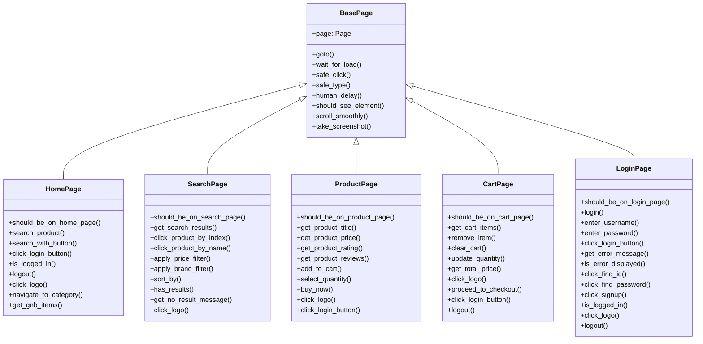
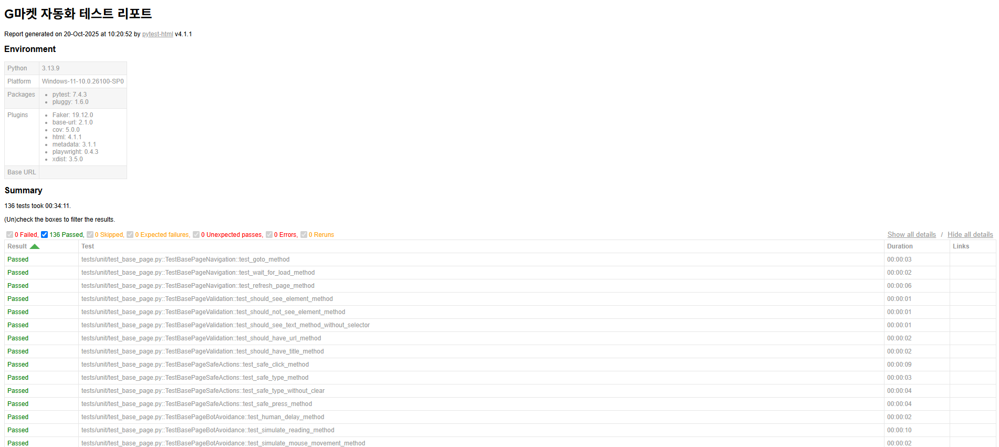
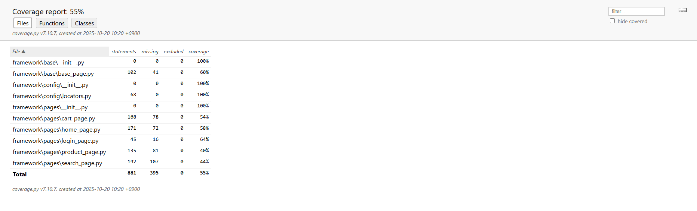

# 🛒 G마켓 자동화 테스트 프로젝트

[](https://www.python.org/)
[](https://playwright.dev/)
[](https://github.com/psf/black)
[](https://github.com/Yangsun94/Gmarket_Project.git)

Playwright를 활용한 G마켓 쇼핑몰 E2E 자동화 테스트 프레임워크입니다.

## 📋 목차

- [프로젝트 소개](#-프로젝트-소개)
- [주요 기능](#-주요-기능)
- [기술 스택](#-기술-스택)
- [프로젝트 구조](#-프로젝트-구조)
- [설치 방법](#-설치-방법)
- [사용 방법](#-사용-방법)
- [테스트 실행](#-테스트-실행)
- [CI/CD](#-cicd)
- [코드 품질](#-코드-품질)
- [학습 내용](#-학습-내용)

## 🎯 프로젝트 소개

이 프로젝트는 G마켓 쇼핑몰의 주요 기능을 자동으로 테스트하는 E2E(End-to-End) 테스트 프레임워크입니다. Page Object Model 패턴을 적용하여 유지보수성과 재사용성을 높였으며, pytest를 기반으로 체계적인 테스트 환경을 구축했습니다.

### 🎓 학습 목표

- **Playwright**를 활용한 웹 자동화 테스트 구현
- **Page Object Model** 디자인 패턴 적용
- **단위 테스트** 작성
- **GitHub Actions**를 통한 CI/CD 파이프라인 구축
- **코드 품질 관리** 자동화 (Black, isort, Flake8, Pylint)

## ✨ 주요 기능

### 테스트 범위

- ✅ **홈페이지**: 방문, 로고 클릭, 검색 기능
- ✅ **검색 페이지**: 상품 검색, 필터링, 정렬, 상품 클릭
- ✅ **상품 상세 페이지**: 상품 정보 조회, 장바구니 담기
- ✅ **장바구니**: 상품 확인, 수량 변경, 삭제
- ✅ **로그인/로그아웃**: 인증 플로우

### 특징

- 🤖 **봇 탐지 우회**: 자연스러운 사용자 행동 시뮬레이션
- 📸 **자동 스크린샷**: 테스트 실패 시 자동 캡처
- 📊 **HTML 리포트**: 테스트 결과 시각화
- 🔄 **재사용 가능한 구조**: Page Object Model 패턴
- 🧪 **단위 테스트**: 계층적 테스트 구조
- ⚡ **병렬 실행**: pytest-xdist를 통한 빠른 테스트

# 🏗️ 프로젝트 아키텍처

## 전체 구조

```mermaid
graph TB
    subgraph "테스트 레이어"
        UT[단위 테스트<br/>test_base_page.py<br/>test_home_page.py<br/>test_search_page.py<br/>test_product_page.py<br/>test_cart_page.py<br/>test_login_page.py]
    end

    subgraph "페이지 객체 레이어 (POM)"
        HP[HomePage]
        SP[SearchPage]
        PP[ProductPage]
        CP[CartPage]
        LP[LoginPage]
    end

    subgraph "기반 레이어"
        BP[BasePage<br/>공통 메서드<br/>- 페이지 이동<br/>- 봇 탐지 우회<br/>- 스크롤<br/>- 검증]
        LC[Locators<br/>모든 셀렉터<br/>- GmarketLocators<br/>- SearchPageLocators<br/>- ProductPageLocators<br/>- CartPageLocators<br/>- LoginPageLocators]
    end

    subgraph "설정 레이어"
        CF[conftest.py<br/>- 브라우저 설정<br/>- Fixture<br/>- logged_in_context<br/>- logged_in_page]
        PI[pytest.ini<br/>- 테스트 옵션<br/>- 마커 설정]
        ENV[.env<br/>환경 변수]
    end

    subgraph "실행 환경"
        PW[Playwright<br/>브라우저 자동화]
        GM[G마켓 웹사이트]
    end

    UT --> HP
    UT --> SP
    UT --> PP
    UT --> CP
    UT --> LP

    HP --> BP
    SP --> BP
    PP --> BP
    CP --> BP
    LP --> BP

    HP --> LC
    SP --> LC
    PP --> LC
    CP --> LC
    LP --> LC

    CF --> UT
    PI --> UT
    ENV --> CF

    BP --> PW
    PW --> GM

    style UT fill:#e1f5ff
    style HP fill:#fff4e1
    style SP fill:#fff4e1
    style PP fill:#fff4e1
    style CP fill:#fff4e1
    style LP fill:#fff4e1
    style BP fill:#f0f0f0
    style LC fill:#f0f0f0
    style CF fill:#e8f5e9
    style PI fill:#e8f5e9
    style ENV fill:#e8f5e9
    style PW fill:#fce4ec
    style GM fill:#fce4ec
```



## Page Object Model 패턴



## 🛠 기술 스택

### Core
- **Python 3.10+**: 메인 언어
- **Playwright 1.48.0**: 웹 자동화 라이브러리
- **pytest 8.3.3**: 테스트 프레임워크

### Testing
- **pytest-html**: HTML 테스트 리포트 생성
- **pytest-xdist**: 병렬 테스트 실행
- **pytest-playwright**: Playwright pytest 플러그인

### Code Quality
- **Black**: 코드 포맷터
- **isort**: Import 정렬
- **Flake8**: 린터 (PEP 8 검사)
- **Pylint**: 정적 코드 분석
- **pre-commit**: Git hook 자동화

### CI/CD
- **GitHub Actions**: 자동화 워크플로우
- **Safety**: 보안 취약점 검사

## 📁 프로젝트 구조

```
gmarket-automation/
├── .github/
│   └── workflows/
│       └── quality-check.yml      # CI/CD 파이프라인
├── framework/
│   ├── base/
│   │   └── base_page.py           # 모든 페이지의 베이스 클래스 (18개 메서드)
│   ├── config/
│   │   └── locators.py            # 모든 페이지 Locator 정의 (5개 클래스)
│   └── pages/
│       ├── home_page.py           # 홈페이지 (9개 메서드)
│       ├── search_page.py         # 검색 페이지 (11개 메서드)
│       ├── product_page.py        # 상품 상세 페이지 (11개 메서드)
│       ├── cart_page.py           # 장바구니 페이지 (11개 메서드)
│       └── login_page.py          # 로그인 페이지 (13개 메서드)
├── tests/
│   └── unit/                      # 단위 테스트
│       ├── test_base_page.py      # BasePage 단위 테스트 (18개)
│       ├── test_home_page.py      # HomePage 단위 테스트 (17개)
│       ├── test_search_page.py    # SearchPage 단위 테스트 (24개)
│       ├── test_product_page.py   # ProductPage 단위 테스트 (11개)
│       ├── test_cart_page.py      # CartPage 단위 테스트 (30개)
│       └── test_login_page.py     # LoginPage 단위 테스트 (13개)
├── reports/                       # 테스트 리포트 저장 폴더
├── .env                           # 환경 변수 (git 제외)
├── .env.example                   # 환경 변수 예시
├── .gitignore                     # Git 제외 파일
├── .pre-commit-config.yaml        # pre-commit 설정
├── conftest.py                    # pytest 설정 및 fixture
├── pytest.ini                     # pytest 옵션 설정
├── requirements.txt               # 프로젝트 의존성
└── README.md                      # 프로젝트 문서
```

## 🚀 설치 방법

### 1. 저장소 클론

```bash
git clone https://github.com/Yangsun94/Gmarket_Project.git
cd gmarket-automation
```

### 2. 가상환경 생성 및 활성화

```bash
# Windows
python -m venv venv
venv\Scripts\activate

# macOS/Linux
python3 -m venv venv
source venv/bin/activate
```

### 3. 의존성 설치

```bash
pip install -r requirements.txt
playwright install chromium
```

### 4. 환경 변수 설정

`.env.example`을 복사하여 `.env` 파일을 생성하고 계정 정보를 입력합니다:

```bash
cp .env.example .env
```

`.env` 파일 예시:
```env
TEST_ID=your_gmarket_id
TEST_PASSWORD=your_gmarket_password
```

### 5. pre-commit 설치

```bash
pre-commit install
```

## 🧪 테스트 실행

### 전체 단위 테스트 실행

```bash
pytest tests/unit/ -v
```

### 특정 테스트 파일만 실행

```bash
# BasePage 테스트
pytest tests/unit/test_base_page.py -v

# HomePage 테스트
pytest tests/unit/test_home_page.py -v

# 장바구니 테스트
pytest tests/unit/test_cart_page.py -v
```

### 특정 마커로 실행

```bash
# smoke 테스트만 (빠른 핵심 검증)
pytest tests/unit/ -m smoke -v

# 로그인 테스트만
pytest tests/unit/ -m login -v

# 장바구니 테스트만
pytest tests/unit/ -m cart -v

# 느린 테스트 제외
pytest tests/unit/ -m "not slow" -v

# login 제외하고 병렬 실행
pytest tests/unit/ -m "not login" -n auto
```

### pytest 마커 설명

| 마커 | 설명 | 사용 예시 |
|------|------|----------|
| `smoke` | 핵심 기능 빠른 검증 | `pytest -m smoke` |
| `regression` | 회귀 테스트 | `pytest -m regression` |
| `login` | 로그인 필요 (순차 실행) | `pytest -m login` |
| `cart` | 장바구니 관련 | `pytest -m cart` |
| `slow` | 느린 테스트 | `pytest -m "not slow"` |

### 병렬 테스트 실행

```bash
# 자동으로 CPU 코어 수만큼 병렬 실행
pytest tests/unit/ -n auto

# 특정 워커 수 지정 (4개)
pytest tests/unit/ -n 4

# login 테스트 제외하고 병렬 실행
pytest tests/unit/ -m "not login" -n auto
```

### HTML 리포트 생성

```bash
pytest tests/unit/ --html=reports/report.html --self-contained-html
```

### 테스트 커버리지 측정

```bash
# 커버리지 측정 + HTML 리포트
pytest tests/unit/ --cov=framework --cov-report=html --cov-report=term

# 리포트 확인
open htmlcov/index.html  # macOS
start htmlcov/index.html  # Windows
xdg-open htmlcov/index.html  # Linux
```

**현재 테스트 커버리지: 52%** 🎯

## 🎬 테스트 실행 결과

### 📊 테스트 리포트


**전체 테스트 결과 요약:**
- ✅ **122개 테스트 모두 통과**
- 📂 **6개 테스트 파일** (test_base_page, test_home_page, test_search_page, test_product_page, test_cart_page, test_login_page)
- ⚡ **병렬 실행 지원** (pytest-xdist)
- 📸 **실패 시 자동 스크린샷 저장**
- 📝 **상세 로그 및 에러 추적**

---

### 📈 코드 커버리지


**커버리지 측정 결과:**

| 모듈 | Statements | Missing | Coverage |
|------|-----------|---------|----------|
| `base/base_page.py` | 102 | 41 | **60%** |
| `pages/cart_page.py` | 184 | 95 | **48%** |
| `pages/home_page.py` | 195 | 96 | **51%** |
| `pages/login_page.py` | 47 | 17 | **64%** |
| `pages/product_page.py` | 150 | 100 | **33%** |
| `pages/search_page.py` | 192 | 105 | **45%** |
| **TOTAL** | **938** | **454** | **52%** ⚠️ |

---

### 💡 리포트 직접 확인

테스트 실행 후 생성되는 리포트를 직접 확인할 수 있습니다:

```bash
# 테스트 실행
pytest tests/unit/ -v

# HTML 리포트 열기
start reports/html-report.html        # 테스트 결과
start reports/coverage/index.html     # 커버리지 상세
```

---

## 🔄 CI/CD

### GitHub Actions

이 프로젝트는 GitHub Actions를 통해 자동화된 코드 품질 검사를 수행합니다.

> G마켓의 강력한 봇 탐지 시스템으로 인해 CI/CD 환경에서는 E2E 테스트 대신 **코드 품질 검사**를 수행합니다.

### 자동 실행 조건

- **Push**: `main`, `develop` 브랜치에 코드 푸시 시
- **Pull Request**: `main`, `develop` 브랜치로 PR 생성 시
- **Manual**: GitHub Actions 탭에서 수동 실행 가능

### 검사 항목

#### 코드 품질 검사
- **Flake8**: PEP 8 스타일 가이드 준수 확인
- **Black**: 코드 포맷팅 일관성 검사
- **Pylint**: 상세한 코드 품질 분석
- **isort**: Import 문 정렬 확인

#### 보안 검사
- **Safety**: 알려진 보안 취약점 검사

### 로컬 테스트 실행

E2E 테스트는 로컬 환경에서만 실행 가능합니다:

```bash
# 전체 단위 테스트
pytest tests/unit/ -v

# smoke 테스트 (빠른 검증)
pytest tests/unit/ -m smoke -v

# 병렬 실행 (login 제외)
pytest tests/unit/ -m "not login" -n auto

# 커버리지 측정
pytest tests/unit/ --cov=framework --cov-report=html
```

## ✅ 코드 품질

### 로컬에서 코드 품질 검사

```bash
# 1. Black: 코드 포맷팅
black framework/ tests/ --line-length=120

# 2. isort: Import 정렬
isort framework/ tests/ --profile black

# 3. Flake8: 스타일 검사
flake8 framework/ tests/ --max-line-length=120 --extend-ignore=E203,W503

# 4. Pylint: 정적 분석
pylint framework/ --fail-under=7.0

# 5. Safety: 보안 검사
safety check
```

### pre-commit 사용

Git commit 시 자동으로 코드 품질 검사가 실행됩니다:

```bash
git add .
git commit -m "feat: 새 기능 추가"
# → Black, isort, Flake8가 자동 실행됨
```

전체 파일 검사:

```bash
pre-commit run --all-files
```

## 🔧 주요 Fixtures (conftest.py)

### 세션 스코프 로그인
```python
@pytest.fixture(scope="session")
def logged_in_context(playwright):
    """
    세션 전체에서 재사용되는 로그인 컨텍스트
    - Rate Limiting 문제 해결
    - 로그인 상태 유지
    """
```

### 로그인된 페이지
```python
@pytest.fixture
def logged_in_page(logged_in_context):
    """
    로그인된 상태의 페이지 제공
    - 로그인 테스트에서 사용
    """
```

### 기본 페이지
```python
@pytest.fixture
def page(context):
    """
    기본 Playwright 페이지
    - 대부분의 테스트에서 사용
    """
```

## 📚 학습 내용

이 프로젝트를 통해 다음을 학습했습니다:

### 1. 웹 자동화 테스트
- ✅ Playwright를 활용한 E2E 테스트 자동화
- ✅ Page Object Model 디자인 패턴 적용
- ✅ 봇 탐지 우회 기법 (자연스러운 딜레이, 랜덤 타이핑)

### 2. 테스트 설계
- ✅ 단위 테스트 작성 및 52% 커버리지 달성
- ✅ pytest fixture를 활용한 테스트 격리
- ✅ 테스트 마커를 통한 선택적 실행
- ✅ 파라미터화 테스트로 다양한 시나리오 검증
- ✅ Rate Limiting 문제 해결 (세션 스코프 fixture)

### 3. CI/CD 파이프라인
- ✅ GitHub Actions 워크플로우 구축
- ✅ 코드 품질 자동화 검증

### 4. 코드 품질 관리
- ✅ Black, isort를 통한 일관된 코드 스타일 유지
- ✅ Flake8, Pylint를 통한 코드 품질 검증
- ✅ pre-commit hooks를 통한 자동화
